# AutoDRIVE Hunter SE Dataset

### Dynamics and Perception Dataset of "Hunter SE" Robot

<table>
<thead>
  <tr>
    <th align="center"></th>
    <th align="center"></th>
  </tr>
</thead>
<tbody>
  <tr>
    <td align="center">Keyboard Teleoperation</td>
    <td align="center">Mouse Teleoperation</td>
  </tr>
  <tr>
    <td align="center"></td>
    <td align="center"></td>
  </tr>
  <tr>
    <td align="center">Joystick Teleoperation</td>
    <td align="center">Driving Rig Teleoperation</td>
  </tr>
</tbody>
</table>

This repository uses [AutoDRIVE Ecosystem](https://autodrive-ecosystem.github.io/) to capture data from a 1:5 scale Ackerman-steered vehicle called Hunter SE. The source repository for AutoDRIVE Ecosystem can be found [here](https://github.com/Tinker-Twins/AutoDRIVE).

## Dataset Structure:

The vehicle dataset comprises the following:

| **DATA** | timestamp | throttle |	steering | leftTicks | rightTicks |	posX | posY |	posZ | roll |	pitch |	yaw |	speed |	angX |	angY |	angZ | accX |	accY | accZ |
| -------- | --------- | -------- |	-------- | --------- | ---------- |	---- | ---- |	---- | ---- |	----- |	--- |	----- |	---- |	---- |	---- | ---- |	---- | ---- |
| **UNIT** | yyyy_MM_dd_HH_mm_ss_fff | norm% | rad | count | count |	m | m |	m | rad |	rad |	rad |	m/s |	rad/s |	rad/s |	rad/s | m/s^2 |	m/s^2 | m/s^2 |

## Vehicle Parameters:
- Wheelbase (m): 0.55
- Track width (m): 0.52
- Center of mass* (m): [x: 0.330, y: 0.000, z: 0.087]

  *Center of mass is measured w.r.t. the center of rear axle.
- Suspension stiffness (N/m): 22700
- Suspension damping (Ns/m): 7000
- Throttle Limit (norm%): 1.0000
- Steering Limit (rad): 0.5236
- Linear Velocity Limit (m/s): 3.5611
- Angular Velocity Limit (rad/s): 2.0708
- [Throttle vs. Velocity Mapping](https://github.com/Tinker-Twins/AutoDRIVE-Hunter-SE-Dataset/blob/off-road-dataset/vehicle_parameters/HunterSE_Throttle_Velocity_Mapping.xlsx):

  

## Automated Data Collection:

The [`open_loop_control.py`](https://github.com/Tinker-Twins/AutoDRIVE-Hunter-SE-Dataset/blob/off-road-dataset/open_loop_controller/open_loop_control.py) script makes use of [AutoDRIVE Devkit's](https://github.com/Tinker-Twins/AutoDRIVE/tree/AutoDRIVE-Devkit) [Python API](https://github.com/Tinker-Twins/AutoDRIVE/tree/AutoDRIVE-Devkit/ADSS%20Toolkit/autodrive_py). The script is capable of selecting a maneuver and its direction, and controlling the vehicle actuators within the prescribed limits in an open-loop setting.

```bash
python3 open_loop_control.py --maneuver={straight, skidpad, fishhook, slalom} --direction={cw, ccw} --throttle=[-1, 1] --steering=[0, 0.5236] --throttle_noise=[0, 0.001] --steering_noise=[0, 0.001]
```

**Control Input Variations:**

- **Throttle Gradations (norm%):** 0.2, 0.4, 0.6, 0.8, 1.0 (straight maneuver has additional throttle gradations: 0.1, 0.3, 0.5, 0.7, 0.9)
- **Steering Gradations (rad):** 0.1047, 0.2094, 0.3142, 0.4189, 0.5236 (straight maneuver does not have any steering gradations)

## Maneuver Visualization

<table>
<thead>
  <tr>
    <th align="center">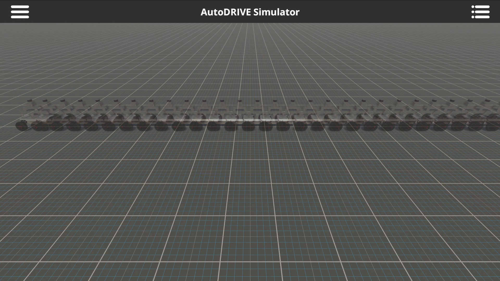</th>
    <th align="center">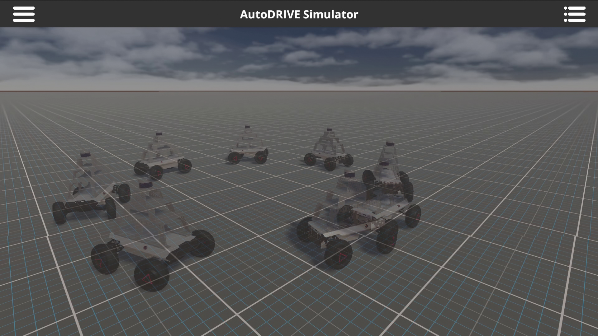</th>
  </tr>
</thead>
<tbody>
  <tr>
    <td align="center">Straight Maneuver</td>
    <td align="center">Skidpad Maneuver</td>
  </tr>
  <tr>
    <td align="center"></td>
    <td align="center">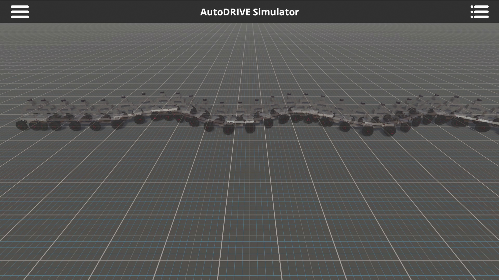</td>
  </tr>
  <tr>
    <td align="center">Fishhook Maneuver</td>
    <td align="center">Slalom Maneuver</td>
  </tr>
</tbody>
</table>

## Data Visualization

[Single Maneuver Data Visualization](https://github.com/Tinker-Twins/AutoDRIVE-Hunter-SE-Dataset/blob/off-road-dataset/data_visualization/data_visualization_single.ipynb)

<table>
<thead>
  <tr>
    <th align="center">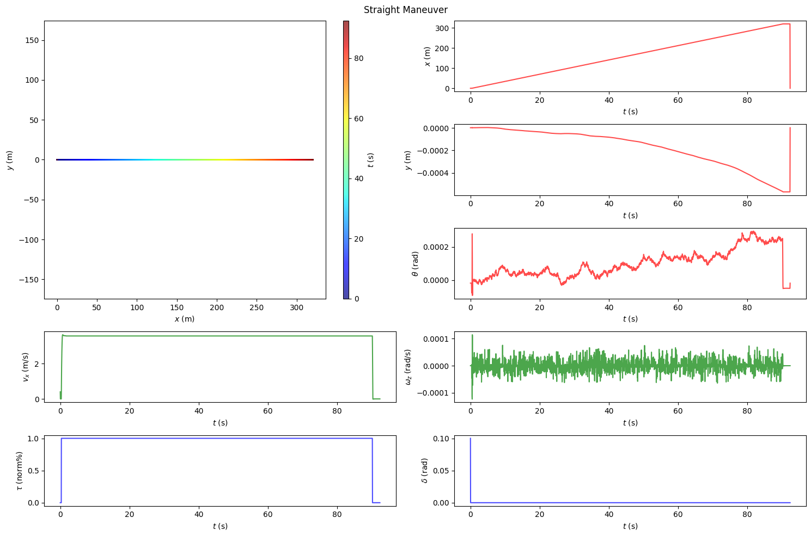</th>
    <th align="center">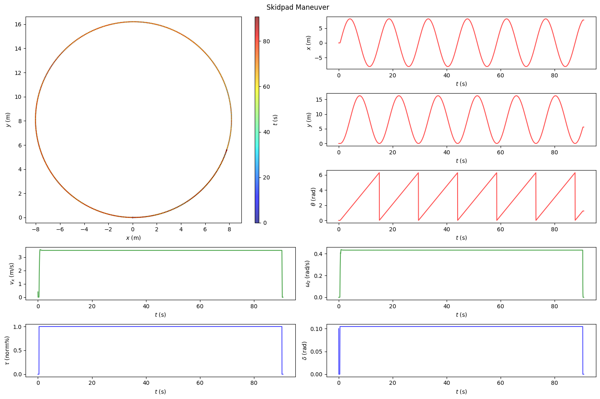</th>
  </tr>
</thead>
<tbody>
  <tr>
    <td align="center">Straight Maneuver</td>
    <td align="center">Skidpad Maneuver</td>
  </tr>
  <tr>
    <td align="center">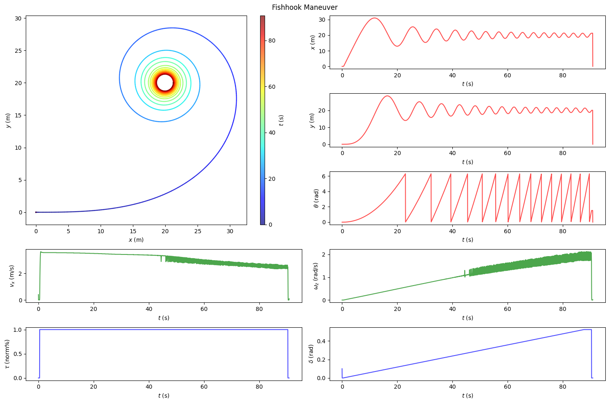</td>
    <td align="center">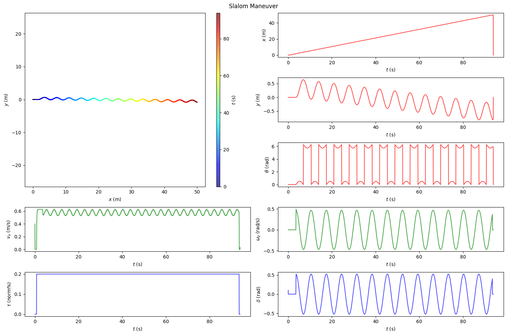</td>
  </tr>
  <tr>
    <td align="center">Fishhook Maneuver</td>
    <td align="center">Slalom Maneuver</td>
  </tr>
</tbody>
</table>

[Collective Maneuver Data Visualization](https://github.com/Tinker-Twins/AutoDRIVE-Hunter-SE-Dataset/blob/off-road-dataset/data_visualization/data_visualization_collective.ipynb)

<table>
<thead>
  <tr>
    <th align="center">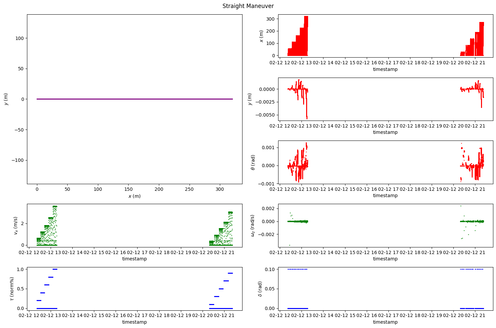</th>
    <th align="center">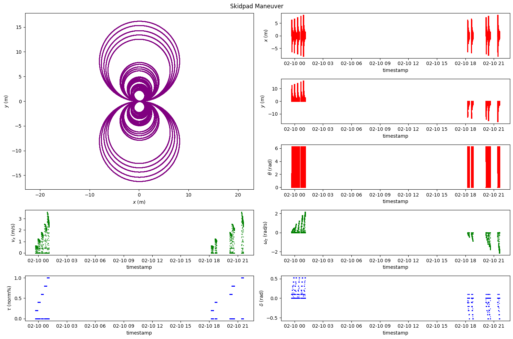</th>
  </tr>
</thead>
<tbody>
  <tr>
    <td align="center">Straight Maneuver</td>
    <td align="center">Skidpad Maneuver</td>
  </tr>
  <tr>
    <td align="center">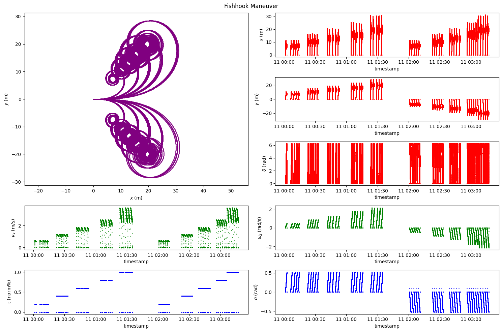</td>
    <td align="center"></td>
  </tr>
  <tr>
    <td align="center">Fishhook Maneuver</td>
    <td align="center">Slalom Maneuver</td>
  </tr>
  <tr>
    <td align="center" colspan="2">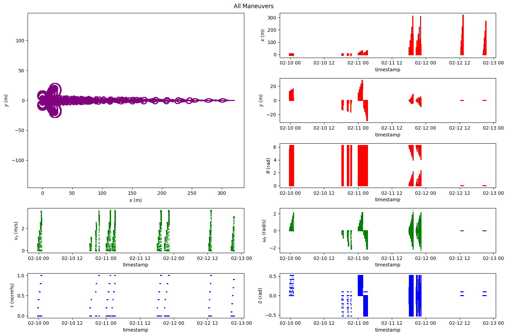</td>
  </tr>
  <tr>
    <td align="center" colspan="2">All Maneuvers</td>
  </tr>
</tbody>
</table>

## Citation

We encourage you to read and cite the following papers if you use any part of this dataset for your research:

#### [AutoDRIVE: A Comprehensive, Flexible and Integrated Digital Twin Ecosystem for Enhancing Autonomous Driving Research and Education](https://arxiv.org/abs/2212.05241)
```bibtex
@article{AutoDRIVE-Ecosystem-2023,
author = {Samak, Tanmay and Samak, Chinmay and Kandhasamy, Sivanathan and Krovi, Venkat and Xie, Ming},
title = {AutoDRIVE: A Comprehensive, Flexible and Integrated Digital Twin Ecosystem for Autonomous Driving Research &amp; Education},
journal = {Robotics},
volume = {12},
year = {2023},
number = {3},
article-number = {77},
url = {https://www.mdpi.com/2218-6581/12/3/77},
issn = {2218-6581},
doi = {10.3390/robotics12030077}
}
```
This work has been published in **MDPI Robotics.** The open-access publication can be found on [MDPI](https://doi.org/10.3390/robotics12030077).

#### [AutoDRIVE Simulator: A Simulator for Scaled Autonomous Vehicle Research and Education](https://arxiv.org/abs/2103.10030)
```bibtex
@inproceedings{AutoDRIVE-Simulator-2021,
author = {Samak, Tanmay Vilas and Samak, Chinmay Vilas and Xie, Ming},
title = {AutoDRIVE Simulator: A Simulator for Scaled Autonomous Vehicle Research and Education},
year = {2021},
isbn = {9781450390453},
publisher = {Association for Computing Machinery},
address = {New York, NY, USA},
url = {https://doi.org/10.1145/3483845.3483846},
doi = {10.1145/3483845.3483846},
booktitle = {2021 2nd International Conference on Control, Robotics and Intelligent System},
pages = {1–5},
numpages = {5},
location = {Qingdao, China},
series = {CCRIS'21}
}
```
This work has been published in **2021 International Conference on Control, Robotics and Intelligent System (CCRIS).** The publication can be found on [ACM Digital Library](https://dl.acm.org/doi/abs/10.1145/3483845.3483846).
